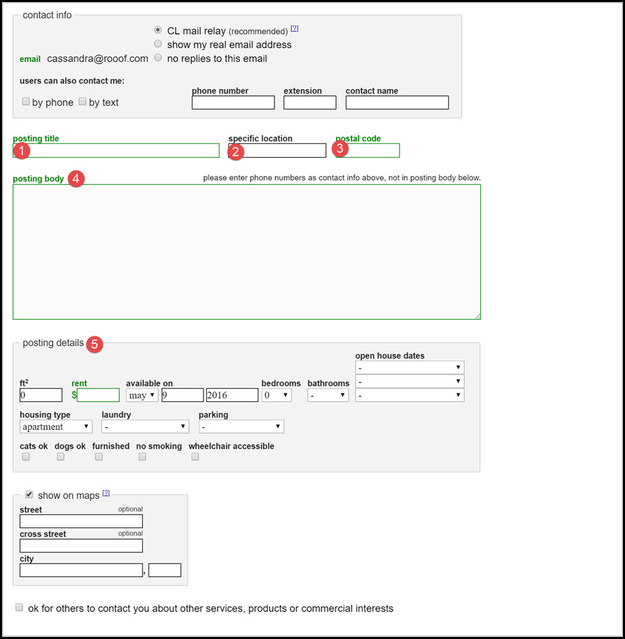
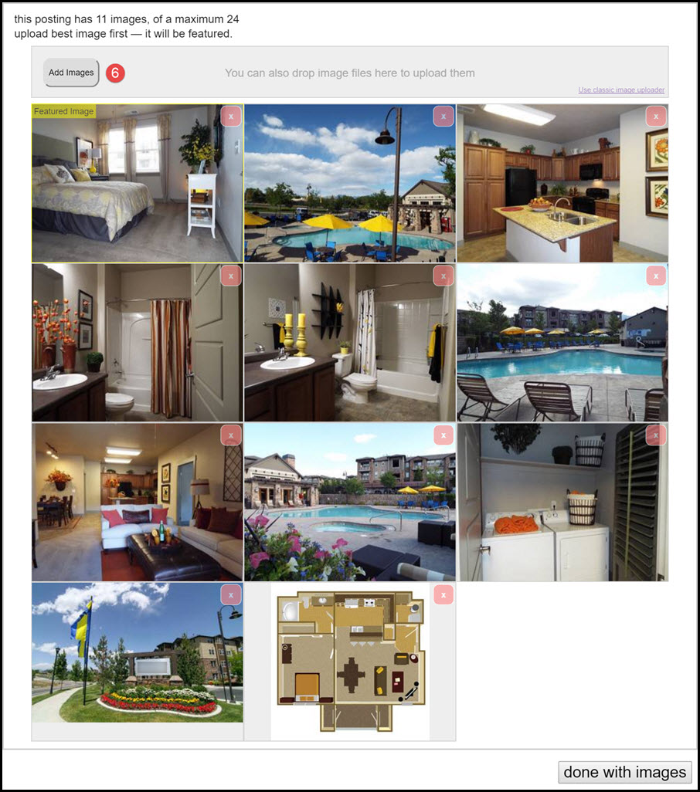
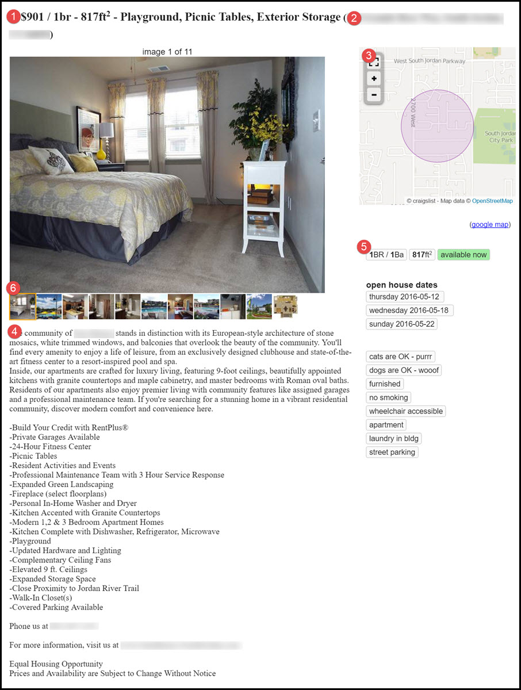

# Anatomy of a PostThis section will break down a Craigslist ad piece by piece and display where the information ends up on the ad.**The number beside a field corresponds to a description and location in the finished ad example below.**1. **Posting Title** - The title of the post is what is shown to viewers in a search result. Rooof generates titles by randomly selecting three amenities.2. **Location** - The parentheses after a title shows the specific location within the city. This may be the street address for the property, or a community within the city that people may search for. Rooof pulls this information from your property website and from information stored in settings.3. **Map** - The map displays a pin dropped at the property location. This helps potential residents see exactly where your property is located. Roof pulls this information for you.4. **Body Text** - This text gives viewers more details about the listing. In most cases this includes some romance text, an amenities list, contact information and any disclaimers. This is pulled from the property website and the optional settings you have stored in Rooof.5. **Posting Details** - This displays critical information about the unit that will interest most viewers. This information is pulled from your property website, but can also be set in advance to be the same every time.6. **Photos** - Rooof pulls photos from the property website and puts them in random order##Building an Ad##Finished Ad ---**You may also be interested in:**- [Craigslist Lifecycle](http://docs.rooof.com/craigslistlifecycle_md.html)- [Craigslist Problems](http://docs.rooof.com/craigslist_problems.html)- [Minimum Required Fields](http://docs.rooof.com/requiredfields_md.html) 
